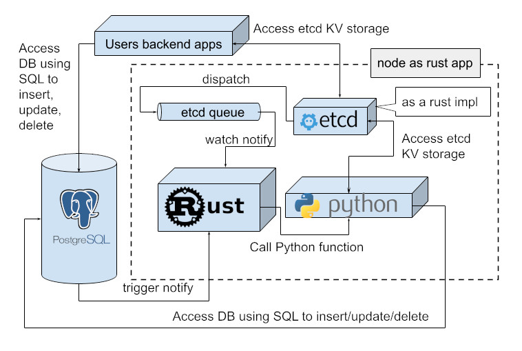

# RPPD - Rust Python Postgres Discovery

## Top features:

- Etcd integration with either Rust implementation for message queue and valilla impl for topic notify
- Cluster/Cloud oriented for horizontal scalling
- Lightwight (but still with std lib)
- Simple cofiguration
- Protobuf with gRPC
- Embeddable to use as lib in your project
- i18n for message translation


## Build
> [!IMPORTANT]
The target platform is Linux! The key component is pxrg, a rust postgres trigger engine that does not support windows.

> [!NOTE]
https://grpc.io/docs/protoc-installation/


### Build
To build the project requirements
```shell
git clone https://github.com/lupko/etcd3-client.git
cd etcd3-client
pip install .
pip install typing-extensions
```


### FAQ
> [!NOTE]
reinstall

IF
> Mismatched rust versions: cargo-pgrx Mismatched rust versions: cargo-pgrx

Then (this takes time)
```shell
cargo install cargo-pgrx --force && cargo pgrx init 
```

## Overall architecture

- Postgres extension with a trigger to notify backend service about a insert or update or delete event.
- The service is a one to many instances with first act as master and run or forward event execution to the actor nodes.
- All nodes tried to register on master and participate in performance.
- Function trigger created on a target table and relay on topic/queue definition. This might be a column to pass a row id into function.
- The executed code is a python function. 
- The action also available by schedule to implement a cron job.
- All configuration store in db table created by extension.
- If main service shutting down of unavailable than one ot service become a master. 
- No cluster leader election, but whoever be able to safe and undoubted updated self as master on configuration table. 




## Usage

1. Create postgres extension: copy rppd.so and create few tables in desired schema
 > cp -f target/debug/librppd.so /usr/lib/postgresql/14/lib/rppd.so

2. Run as many service as required:
 - a text file in any format OR a dir with a file: rppd.rppd_config names are: 'schema', 'url', 'bind'
 - three optional args, in any order: config schema, db connection url (starts with 'postgres://', binding IP and port default is 'localhost:8881'
 - use PGPASSWORD env variable (or from file) to postgres connection
 - use PGUSER env variable (or read from file) to postgres connection
 - priority is: env (if used), if no use or not set, than app args param, than file, than default 
3. Perform insert or update to configure a callback AND fire a function


> [!NOTE]
Use select the row by ID on INSERT trigger would fail because requested row might not visibly yet depends on transaction isolation. 
The simple workaround is to sleep a second on Python function call.

 

### Use to get more build in help:
```sql
psql> \dx rppd
psql> \df+ rppd*
```

## Python samples

### variables - kwargs

```python 
DB -- database connection
TOPIC -- fc.fns.topic
TABLE -- fc.fns.schema_table
TRIG -- UPDATE = 0;  INSERT = 1;  DELETE = 2;  TRUNCATE = 3;
"COLUMN_NAME" --i.e. "ID" = see trig_value
ETCD -- The etcd client
```

### python example:
```python

sql = "SELECT * FROM {} where a = %s".format(TABLE)
print(sql)

cur = DB.cursor()
cur.execute(sql, (PK))
print(cur.fetchall())

cur.execute("insert into test (b) values (%s)", ( "{}-{}".format(TOPIC, TRIG),))
DB.commit()
```


### test example:
```sql
create table if not exists test_source (id serial primary key, input text);
create table if not exists test_sink (id serial primary key, data text);
\set code `cat test_fn.py`
insert into rppd_function (code, checksum, schema_table, topic, verbose_debug, cleanup_logs_min) values (:'code', 'na', 'public.test_source', '.id', true, 100);
CREATE TRIGGER test_src_event AFTER INSERT OR UPDATE OR DELETE ON test_source FOR EACH ROW EXECUTE PROCEDURE rppd_event();
insert into test_source (input) values ('test input');
select * from test_sink;
```

### python test example
for the test above
```python
cur = DB.cursor()
cur.execute("SELECT input FROM test_source where id = %s", ([ID]))
input = cur.fetchall()
if len(input) > 0:
    cur.execute("insert into test_sink (data) values (%s)", ( input[0] ))
    DB.commit()
```

### etcd test example:
```sql
\set code `cat test_fn_etcd.py`
insert into rppd_function (code, checksum, schema_table, topic, verbose_debug, cleanup_logs_min) values (:'code', 'na', '/q/test', '', true, 100);
```

run
```python
import etcd3
ETCD = etcd3.client("localhost", 8881)
ETCD.put('/q/test/producer/111', 'test kv to etcd queue')
```

check
```sql
select * from test_sink where data like '/q/%';
```


## TODO - features and improvements 
- Connect to multiple DB (rw/ro - replica)
- Monitoring cadence
- OpenTelemetry integration
- Python function code sign, approve and verify on call
- Keyvault (secret) integration for a Database connections

